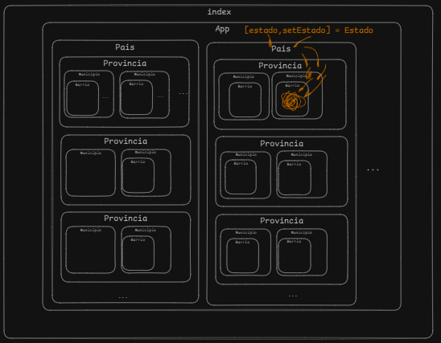

# Practica de Estados en React

este repositorio contiene una practica de estados en React, donde se maneja un estado complejo que incluye paises, provincias, barrios y casas.
Inicialmente se muestra el ejemplo de como renderizar estos datos en componentes anidados, y luego se implementa la funcionalidad para agregar nuevas casas a los barrios existentes.

## Estructura del Proyecto sin Redux

- `src/App.jsx`: Componente principal que maneja el estado de los paises y renderiza los componentes hijos.
- `src/components/Pais.jsx`: Componente que representa un pais y renderiza sus provincias
- `src/components/Provincia.jsx`: Componente que representa una provincia y renderiza sus barrios.
- `src/components/Barrio.jsx`: Componente que representa un barrio y maneja la
- `src/components/Casa.jsx`: Componente que representa una casa.

## Proximamente con Redux Toolkit
Proximamente se implementará Redux toolkit para manejar el estado de la aplicacion de manera mas eficiente.

